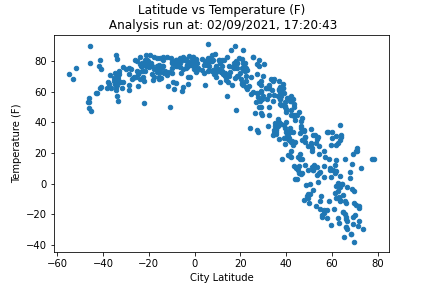
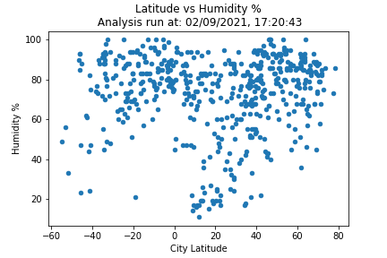
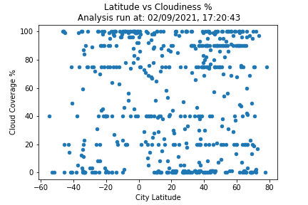
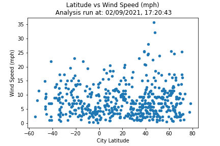
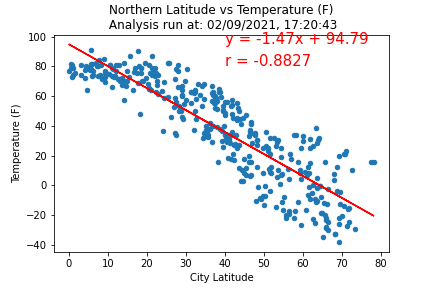
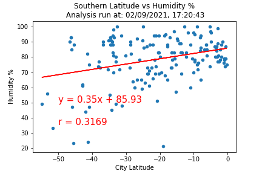
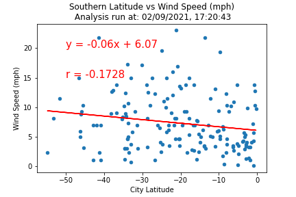

# python-api-challenge

# Python API Homework Submission - What's the Weather Like?

## Overview

This is the Python API Homework submission for: What's the Weather Like?  

Included in this repository are: 
* 2 Jupyter notebooks that solve the homework assignments

  * WeatherPy - searches and identifies 500+ random locations across the globe, logs the process, creates 12 scatter plots / .png files and and creates an output csv

  * VacationPy - takes the csv created in WeatherPy, maps the humidity of each city in a heatmap, selects < 10 cities to add markers for local hotels and adds as an additional layer onto the heatmap.
  

* Word document with 2 Screen Shots showing the VacationPy solution: Heatmap and the Heatmap with markers showing the solutions

* An 'Output' folder with:
  * All of the scatter plots as .png files 
    
    * 4 plots for north south latitudes combined for temperature, humidity, cloud cover and wind) 
  
    * 8 plots for north south latitudes each for temperature, humidity, cloud cover and wind)
  
  * CSV file with the output from the WeatherPy part of the challenge 
 
  * TXT file showing the processing log for creating list of 500+ cities 

## Files

* 2 folders with the solutions to the 2 assignments:

  * [WeatherPy Code](WeatherPy/WeatherPy.ipynb)- searches and identifies 500+ random locations across the globe, logs the process [City_Process_Log.txt](WeatherPy/Output/City_Process_Log.txt) and and creates a csv output file [City_DataFrame_CSV_Output.csv](WeatherPy/Output/City_DataFrame_CSV_Output.csv)

  * [VacationPy Code](VacationPy/VacationPy.ipynb) - reads the [City_DataFrame_CSV_Output.csv](WeatherPy/Output/City_DataFrame_CSV_Output.csv) maps the humidity of each city in a heatmap, selects < 10 cities to add markers for local hotels and adds as an additional layer onto the heatmap. [Word Doc of Screen Shots of maps](VacationPy/Screenshots_of_heatmaps.docx) created for documentation of the heatmap and marker outputs.

* [Scatter Plots](WeatherPy/Output) - Folder with all the scatter plot .pngs (also shown below) of each output showing the final results.

* [Word Doc of Screen Shots of maps](VacationPy/Screenshots_of_heatmaps.docx) - Is a word document that has the screenshots for both maps. 

  
## Screen Shots for Output

### Combined North and South Latitudes

* WeatherPy/Output/City_Lat_vs_Temp_Graph.png..

* WeatherPy/Output/City_Lat_vs_Humidity Graph.png..

* WeatherPy/Output/City_Lat_vs_Cloud_Graph.png..

* WeatherPy/Output/City_Lat_vs_Wind_Graph.png..

### Individuel North and South Latitudes

#### North Latitudes

* WeatherPy/Output/City_N_Lat_vs_Temp_Graph.png.

* WeatherPy/Output/City_N_Lat_vs_Humidity_Graph.png.

* WeatherPy/Output/City_N_Lat_vs_Cloud_Graph.png.

* WeatherPy/Output/City_N_Lat_vs_Wind_Graph.png.

#### South Latitudes

* WeatherPy/Output/City_S_Lat_vs_Temp_Graph.png.

* WeatherPy/Output/City_S_Lat_vs_Humidity_Graph.png.

* WeatherPy/Output/City_S_Lat_vs_Cloud_Graph.png.

* WeatherPy/Output/City_S_Lat_vs_Wind_Graph.png.

